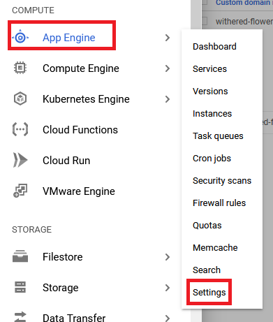
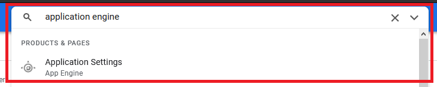
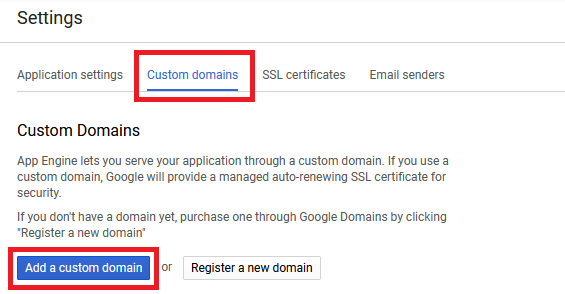
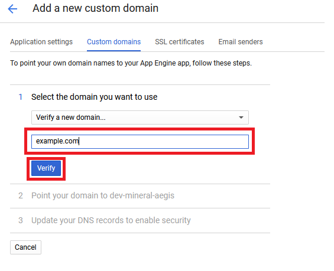
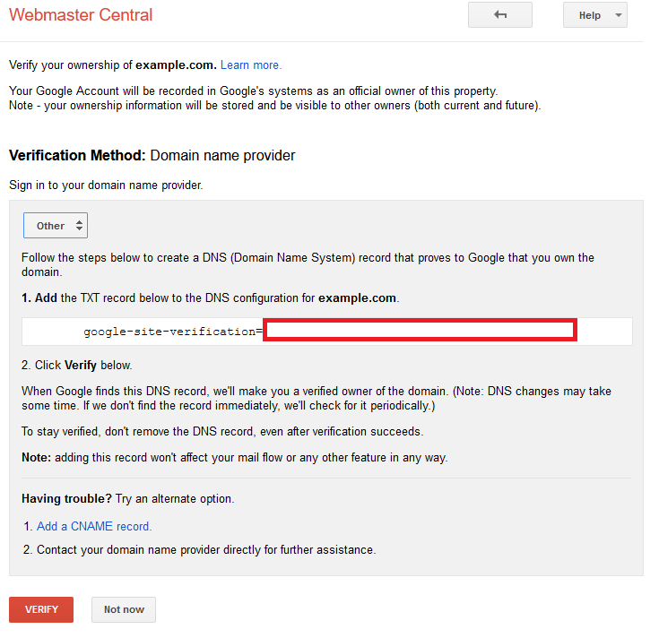

## Google App Example 01
This apps is created using Koa + EJS.

### Description:
- Fetch data from jsonplaceholder.typicode.com (endpoint `/users`)
- Render the fetched data using ejs
- Style the table using MaterializeCSS

### Disclaimer:
- This build is made without using Cloud Build.

### Deploy on Google App Engine (GAE):

Step-by-step to deploy on GAE:
1. Create the apps first (obviously...)
2. Create the package.json run start script (see `package.json` for more 
   details)
3. Create the `app.yaml` for deployment configuration on GAE (see `app.yaml` 
   for more details)
4. Deploy the apps (make sure your terminal already have gcloud sdk installed 
   / using cloudshell) by using `gcloud app deploy`
5. If this is the first time deploying on GAE, choose your region to deploy.  
   **WARNING**: irreversible per project, choose wisely !
5. Continue and wait for the apps to deploy...
6. When the deployment is ready, see the result with `gcloud app browse` and 
   open the link with your browser.
7. Info:  it's auto `HTTPS` 

### Bind custom domain and Google App Engine (GAE):

In this step we will try to bind custom domain (non SSL), 

Requirement:
* Need to have custom domain (obviously...)
* Have deployment on GAE (previous step)
* Access to DNS Management of the custom domain

Step-by-step to bind custom domain:
1. Open Google Cloud Console (console.cloud.google.com)
2. Search the Product from navigation: `App Engine` and then choose `Settings`
   OR search from products and resources: `Application Settings (App Engine)`.  
   App Engine -> Settings  
     
   Search Products and Resources -> Application Settings  
   
3. From the `tab bar` choose `custom domains` and `Add a custom domain`  
   
4. Choose to `verify a new domain` and insert your domain there and then 
   choose `verify`  
   
5. On the new browser tab `Webmaster Central`, choose the domain registrar 
   or provider of the given domain, if it is not listed choose `Other` for 
   manual verification.
6. Note / Copy the given `TXT` record e.g. `google-site-verification=xxxxxxx`.  
   
7. Open a new tab and  your domain DNS Panel / DNS Management and Add the new 
   `TXT` record.
8. Wait for a while for the DNS changes...
9. Click the verify button on the tab `Webmaster Central`
10. After the verification is success, Google will give a new `A`, 
    `AAA`, and `CNAME` record for the verified domain with `Google-managed` and
    `auto renewal of SSL`. Add this new record to the new domain, and wait for
    the new record to be propagated at most 24 hours.
11. After the domain is propagated, you can access the GAE-base apps with your
    custom domain and it's automatically worked on `HTTPS` !